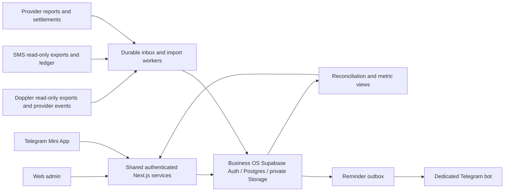

# Business OS — proposed architecture

> 28 September refinement: project-local reporting services now own their calculations and provider imports; Simnetiq consumes versioned read-only exports. Read [function matrix](BUSINESS_OS_FUNCTION_MATRIX.md) and [project API contract](BUSINESS_OS_PROJECT_API_CONTRACT.md) before implementing. These refine the earlier central-ingestion proposal below.

Status: implementation design, not deployed. Confirmed scope: Simnetiq Ltd; GBP; Doppler + SMS; owner-only; dedicated Telegram bot. Proposed timezone Europe/London. This is an internal management system; formal accounting recognition is an explicit later policy decision.

## One application, two presentations

Keep Next.js 16 in this repository. `/admin` is the complete browser dashboard; `/tg` is its mobile presentation. Both call the same authenticated server services and SQL reporting functions. Existing localized public pages retain their root layout, analytics, SEO and route behavior. Add a separate route-group root layout so private pages never inherit public navigation, metadata or analytics. Explicitly dispatch private and auth paths before locale normalization in `proxy.ts`; authorization remains at each server service and database operation.

## Storage and boundaries

Recommend a dedicated Business OS Supabase project to isolate financial records from public mailing-list tables. Do not create it during planning; confirm project/region/plan and cost when implementation needs it. Keep `lib/supabase.ts` and its existing env variables for marketing. New `BUSINESS_OS_*` settings select the private backend. Source systems retain customer auth and payment fulfilment. Central OS is initially a read-only consumer of source financial data; manual OS income/expenses belong only to its own database.

Next Route Handlers accept validated requests and durable inbox inserts. A scheduled worker claims pending jobs with leases, normalizes and posts atomically, tracks cursors and retries, and quarantines poison events. No in-memory background promises after returning a response. One deployment owner manages scheduled workers and webhook endpoints. Use existing backend conventions rather than adding both Edge Functions and Next workers for the same job.

## Product screens

Desktop: Overview; Projects; Sales and transactions; Expenses; Subscriptions (VPN); Traffic; Accounts and payouts; Documents; Business records; Timeline/calendar; Reports; Integrations; Settings/audit.

Telegram: five bottom destinations—Overview, Money, Add, Documents, More. More contains Projects, Traffic, Timeline, Business records and Settings. Eight simultaneous bottom tabs would make quick entry awkward. Every desktop function remains reachable through responsive screens.

Overview answers: how much was sold; how much is expected after fees; what is earned/spent; what cash is available; which project needs attention; what is due next. Show GBP, date basis and source freshness next to figures. Distinct cards for unverified estimates and confirmed balances. Missing data is not zero.

Quick expense: amount/currency, project or shared, category, date; receipt optional; vendor, tax, payment date/status and notes available under details. Record save and receipt upload recover independently. Quick income includes manual source/reference and duplicate check. Transactions open a source trail, components, allocations and corrections.

Documents: metadata search first (title, tags, vendor, category, project, dates); receipt attachment and private preview/download. OCR/full-text content indexing is deferred. Business registry stores company/service references, registration/renewal dates and linked files, not passwords. Financial records, service renewals and manual events feed one timeline; derived events are not copied into editable duplicates.

## Delivery choices

Ship login + Telegram + manual expenses/documents early, then SMS reconciliation, then VPN imports, then analytics and deeper reports. Do not postpone the primary Telegram interface to the end. Prepare roles now but defer invitation/user-management UI while owner-only. Monthly CSV reports first; PDF reporting and sophisticated LTV/cohorts follow reliable data.

## Proposed file map

- `app/(business)/layout.tsx`, `admin/**`, `tg/**`, `login/**`: private root and responsive shells.
- `app/api/business-os/auth/**`, `transactions/**`, `expenses/**`, `documents/**`, `reports/**`: authenticated transport.
- `app/api/business-os/webhooks/[provider]/**`, `jobs/**`: server-authenticated ingestion/worker entrypoints.
- `components/business-os/**`: shared views, forms, filters, metric provenance and empty/error states.
- `lib/business-os/auth/**`, `db/**`, `finance/**`, `integrations/**`, `analytics/**`, `documents/**`, `operations/**`: server-only business services and typed contracts.
- `supabase/business-os/migrations/**`: separate migration project; never apply to marketing by default.
- `tests/business-os/**`: contract, policy, financial and browser tests.
- Modify `proxy.ts`, `.env.example`, `package.json` and private robots/metadata behavior as needed; preserve public route contracts.

Read installed Next docs before implementation; sibling Next 15 patterns are references only. Keep server-only code out of client bundles. Use a decimal library and/or Postgres numeric; pass monetary decimals as strings. Pin shared DTOs before UI and adapter work proceeds concurrently.
